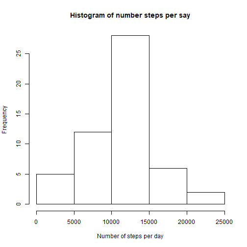
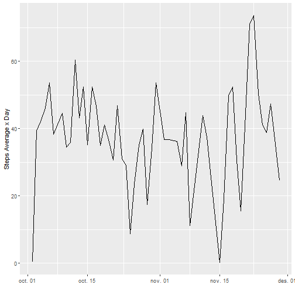
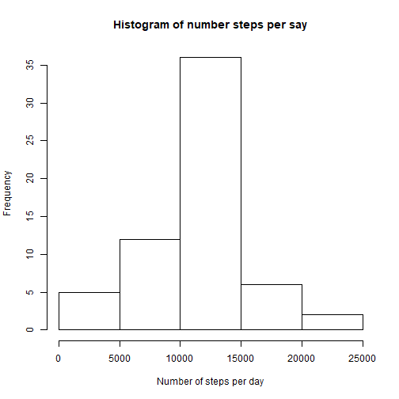
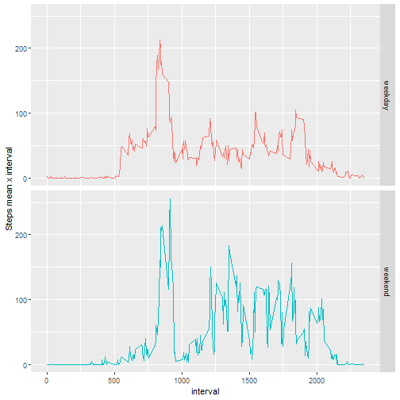

```r
title: "Reproducible Research Course Project 1"
```

```
## Warning: NAs introduced by coercion
```

```
## Error in title:"Reproducible Research Course Project 1": NA/NaN argument
```

```r
output: html_document
```

```
## Error in eval(expr, envir, enclos): object 'output' not found
```


## R Markdown

This is an R Markdown document. This document is the assignment submission for Course Project 1 included in the Reproducible Research course.

This assignment makes use of data from a personal activity monitoring device. This device collects data at 5 minute intervals through out the day. The data consists of two months of data from an anonymous individual collected during the months of October and November, 2012 and include the number of steps taken in 5 minute intervals each day.

The data for this assignment can be downloaded from the course web site:

Dataset: Activity monitoring data [52K]
The variables included in this dataset are:

steps: Number of steps taking in a 5-minute interval (missing values are coded as \color{red}{\verb|NA|}NA)
date: The date on which the measurement was taken in YYYY-MM-DD format
interval: Identifier for the 5-minute interval in which measurement was taken
The dataset is stored in a comma-separated-value (CSV) file and there are a total of 17,568 observations in this dataset.

This submission provides the answer to the 8 exercises included in the assignment.

### 1. Code for reading in the dataset and/or processing the data

The data set file is downloaded in the working repository. The file is read into the 'dset' data frame:


```r
dset <- read.csv("activity.csv")
```

Once loaded we take a look at the data:


```r
summary(dset)
```

```
##      steps                date          interval     
##  Min.   :  0.00   2012-10-01:  288   Min.   :   0.0  
##  1st Qu.:  0.00   2012-10-02:  288   1st Qu.: 588.8  
##  Median :  0.00   2012-10-03:  288   Median :1177.5  
##  Mean   : 37.38   2012-10-04:  288   Mean   :1177.5  
##  3rd Qu.: 12.00   2012-10-05:  288   3rd Qu.:1766.2  
##  Max.   :806.00   2012-10-06:  288   Max.   :2355.0  
##  NA's   :2304     (Other)   :15840
```

```r
str(dset)
```

```
## 'data.frame':	17568 obs. of  3 variables:
##  $ steps   : int  NA NA NA NA NA NA NA NA NA NA ...
##  $ date    : Factor w/ 61 levels "2012-10-01","2012-10-02",..: 1 1 1 1 1 1 1 1 1 1 ...
##  $ interval: int  0 5 10 15 20 25 30 35 40 45 ...
```

We can observe that 'steps' variable has 2304 NA values and that 'date' variable is a character one, we transform it to date. For future uses we also create a data set 'dsetOK' with no NA values:


```r
dset$date <- as.Date.character(dset$date, format = "%Y-%m-%d")
str(dset)
```

```
## 'data.frame':	17568 obs. of  3 variables:
##  $ steps   : int  NA NA NA NA NA NA NA NA NA NA ...
##  $ date    : Date, format: "2012-10-01" "2012-10-01" ...
##  $ interval: int  0 5 10 15 20 25 30 35 40 45 ...
```

```r
dsetOK <- na.omit(dset)
summary(dsetOK)
```

```
##      steps             date               interval     
##  Min.   :  0.00   Min.   :2012-10-02   Min.   :   0.0  
##  1st Qu.:  0.00   1st Qu.:2012-10-16   1st Qu.: 588.8  
##  Median :  0.00   Median :2012-10-29   Median :1177.5  
##  Mean   : 37.38   Mean   :2012-10-30   Mean   :1177.5  
##  3rd Qu.: 12.00   3rd Qu.:2012-11-16   3rd Qu.:1766.2  
##  Max.   :806.00   Max.   :2012-11-29   Max.   :2355.0
```

As we can observe, NA values no longer exist is the cleaned 'dsetOK' data set.


### 2. Histogram of the total number of steps taken each day
First, we have to obtain the the total number of steps per day:


```r
StepsXDay <- aggregate(dset$steps,list(day=dset$date),sum)
```

Then, we are ready to draw the histogram:


```r
hist(StepsXDay$x, xlab = "Number of steps per day", main = "Histogram of number steps per say")
```




### 3. Mean and median number of steps taken each day

We calculate the mean and median of all the steps per day


```r
mean(StepsXDay$x, na.rm = TRUE)
```

```
## [1] 10766.19
```

```r
median(StepsXDay$x, na.rm = TRUE)
```

```
## [1] 10765
```

As we can observe both have almost the same value.


### 4. Time series plot of the average number of steps taken

As we did with sum in the 1st exercise we now calculate the average (mean) steps per day, using, in this case, the data set with no NA values:


```r
StepsMnXDay <- aggregate(dsetOK$steps,list(day=dsetOK$date),mean)
```

In this case, we use ggplot2 to plot the data:


```r
library(ggplot2)
qplot(StepsMnXDay$day, StepsMnXDay$x, geom="line", xlab = "", ylab = "Steps Average x Day")
```




### 5. The 5-minute interval that, on average, contains the maximum number of steps

First we calculate the steps average per interval and then we obtain the 5-minute interval with the maximum number of steps:


```r
StepsMnXInterval <- aggregate(dsetOK$steps,list(interval=dsetOK$interval),mean)
StepsMnXInterval[StepsMnXInterval$x==max(StepsMnXInterval$x),1]
```

```
## [1] 835
```


### 6. Code to describe and show a strategy for imputing missing data


As we observed in the 1st exercise, there are 2304 NA values in the original data set for the 'steps' variable which represent the 13.11% of the total values.

So then we replace those NA values with the mean for the 5-minute interval with a simple loop, generating a new data set:


```r
dsetNew <- dset
for(i in seq_along(dsetNew$steps)) {
  if (is.na(dsetNew$steps[i])) {
    dsetNew$steps[i] <- StepsMnXInterval[StepsMnXInterval$interval==dsetNew$interval[i],2]
  }
}
```


### 7. Histogram of the total number of steps taken each day after missing values are imputed

We reproduce the histogram with the new data set with the replaced NA values:


```r
StepsXDayNew <- aggregate(dsetNew$steps,list(day=dsetNew$date),sum)
hist(StepsXDayNew$x, xlab = "Number of steps per day", main = "Histogram of number steps per say")
```



We can observe the new histogram is higher than the previous one as more values have been added to the data sample.

We can check the new mean and median values:


```r
mean(StepsXDayNew$x)
```

```
## [1] 10766.19
```

```r
median(StepsXDayNew$x)
```

```
## [1] 10766.19
```

And observe than they are almost the same as we have replaced NA values by average values which therefore have low impact on mean & median calculations .


### 8. Panel plot comparing the average number of steps taken per 5-minute interval across weekdays and weekends

We create a new column/variable in our new dataset classifying each record in "weekday" or "weekend", again with a simple loop. We use the weekday numbers instead of the weekday names of the 'weekdays()' function, as it does not work for different languages (I use Catalan as local language and 'weekdays()' function returns names in Catalan, not in English):


```r
for(i in seq_along(dsetNew$date)) {
  if (as.numeric(format(dsetNew$date[i],"%w")) %in% c(6:7)) {
    dsetNew$wd[i] <- "weekend"
  }
  else dsetNew$wd[i] <- "weekday"
}
```

Then, we calculate the average values and plot the data in two fascets for each weekday classification:


```r
StepsMnXDayNew <- aggregate(dsetNew$steps,list(interval=dsetNew$interval, wd = dsetNew$wd), mean)
qplot(interval, x, data = StepsMnXDayNew, facets = wd~., geom = "line", color = wd, ylab="Steps mean x interval") + theme(legend.position="none")
```



We can observe that on the weekdays there is more activity early in the morning than in the weekend and, on the other side, on the weekend there is more activity late in the evening and, in fact, in the whole evening than in the weekdays.


```

